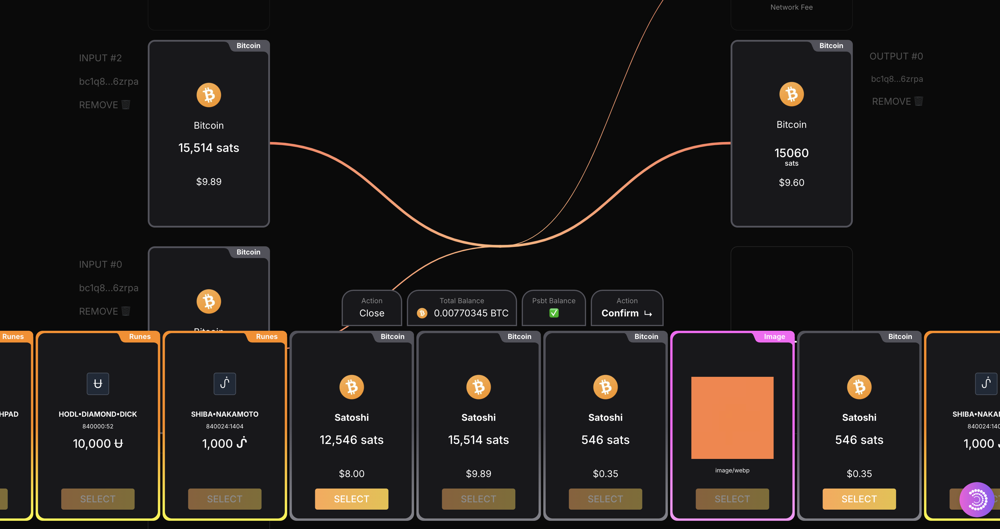
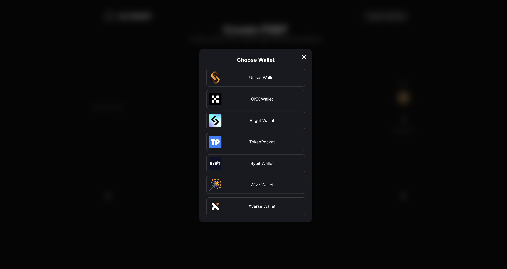
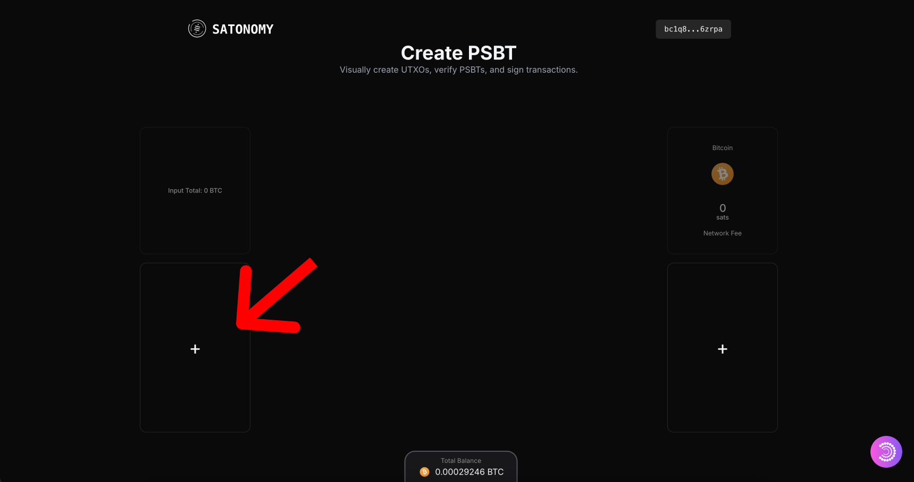
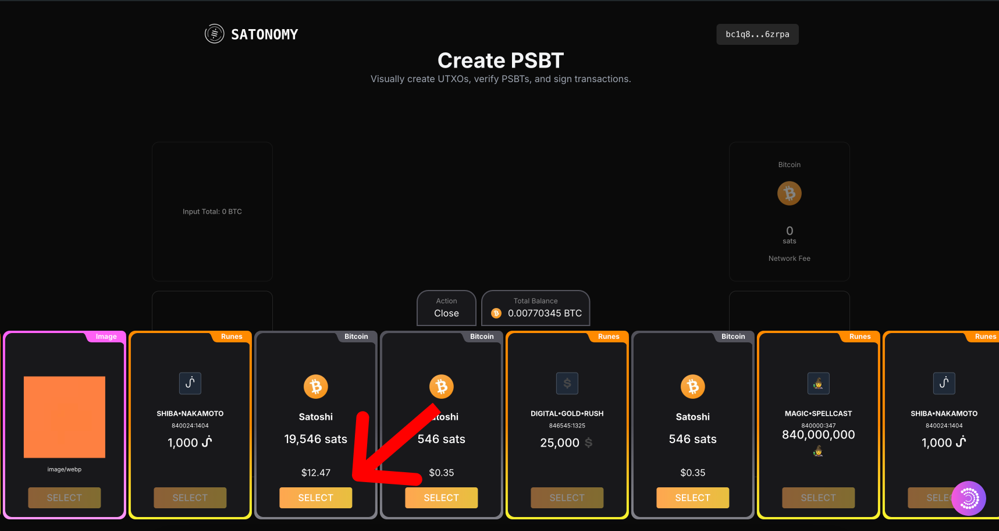
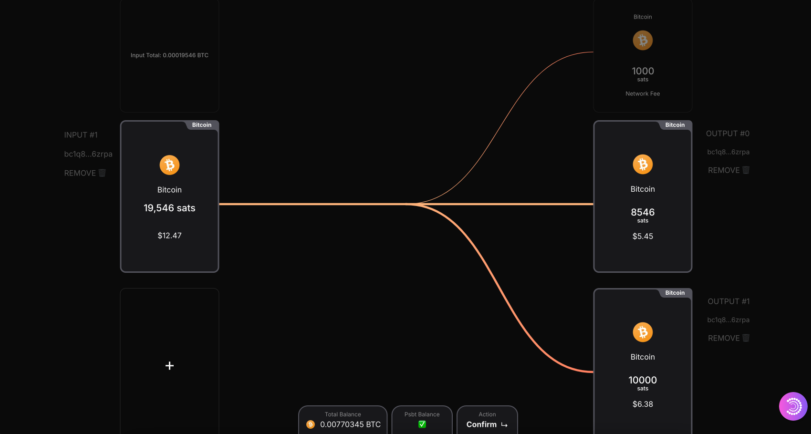

# Satonomy - Effortless Bitcoin Asset Management

Visually create UTXOs and PSBTs with ease. Customize scripts and automate transactions for Bitcoin, Runes, and Ordinals. Seamlessly integrate with non-custodial wallets like XVerse, Unisat, Magic Eden, OKX, and more.

- **Demo**: [satonomy.io](https://satonomy.io)
- **Docs**: [satonomy.gitbook.com](https://satonomy.io)
- **Twitter**: [@satonomy](https://x.com/satonomy)



## Main Technologies

Built with Next.js App Router and TypeScript, utilizing server-side functions for environment security, integration with seven Bitcoin Layer 1 wallets, and connectivity via Particle Network and BTC ConnectKit.

- **BitcoinJS Library**: [`bitcoinjs-lib`](https://github.com/satonomy/utxo-builder/blob/main/app/services/psbtService.ts)
- **Bitcoin Wallet Provider**: [`@particle-network/btc-connectkit`](https://github.com/satonomy/utxo-builder/blob/main/app/providers/ConnectProvider.tsx)
- **Runestone**: [`runelib`](https://github.com/satonomy/utxo-builder/blob/main/app/services/runesService.ts#L8)
- **UTXO Fetcher**: [`mempool`](https://github.com/satonomy/utxo-builder/blob/main/app/services/utxoServices.ts#L47)
- **Runes Balance Fetcher**: [`unisat`](https://github.com/satonomy/utxo-builder/blob/main/app/services/utxoServices.ts#L64)
- **Runes UTXO Fetcher**: [`magiceden`](https://github.com/satonomy/utxo-builder/blob/main/app/services/utxoServices.ts#L64)

### Current Features

- **Transfer** (BTC)
- **Split** (BTC)
- **Merge** (BTC)
- **UTXO Visualizer** (Ordinals, Runes, and Bitcoin)

### Upcoming Features

- **Transfer, Split, and Merge** for Runes, Ordinals, Atomicals, and other UTXO assets
- **Bitcoin Scripts**: Custom pre-built `redeemScripts`, multi-sig, time locks, and more
- **UTXO Optimizer**: Earn by removing unnecessary Satoshis locked in Runes and Ordinals (e.g., optimize a 10k Satoshi NFT to 546 Satoshis, earning 9.5k Satoshis)

## Getting Started

To start the project, add your `.env` variables and run the development server:

````bash
npm i
# or
yarn install

```bash
npm run dev
# or
yarn dev
# or
pnpm dev
# or
bun dev
````

Open [http://localhost:3000](http://localhost:3000) with your browser to see the result.

You can start editing the page by modifying `app/page.tsx`. The page auto-updates as you edit the file.

### Tutorial

1. Connect your Wallet
   

2. Add a new input
   

3. Select the Best UTXO
   

4. Add Outputs and Split (or Multi-Transfer)
   

- Test live on bitcoin: [satonomy.io](satonomy.io)
- Follow us: [@satonomy](https://x.com/satonomy)

#### Notes

This project was created by [@estevanpwr](https://x.com/estevanpwr), [@CryptoShira](https://x.com/CryptoShira) and [@0xtoony](https://x.com/0xtoony) for the Bitcoin Hackathon Olympics. Our team is committed to continuing development beyond the competition.
